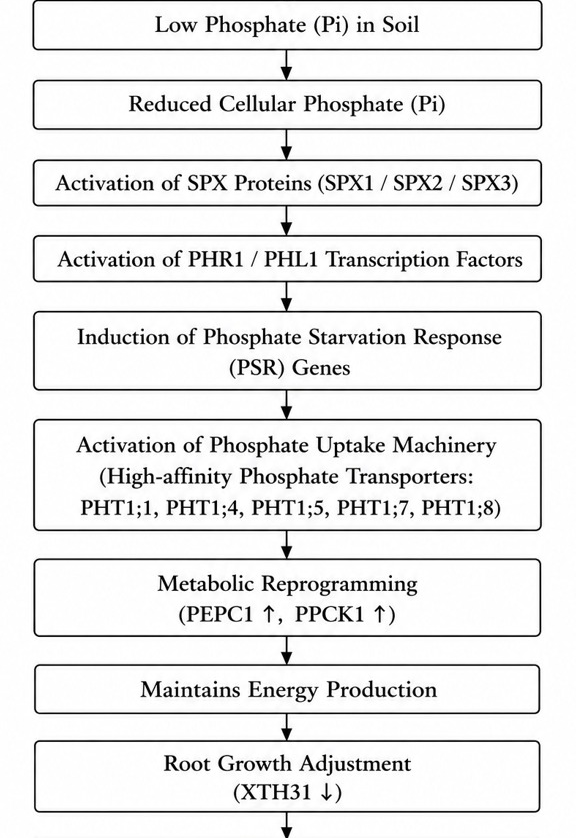
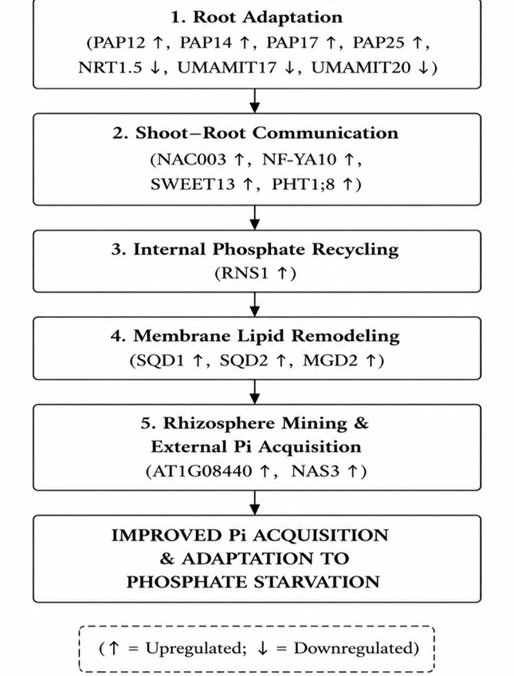

# Integrated Biological Interpretation

The conserved genes identified from the short-term and long-term meta-analyses were integrated with their associated biological functions to develop a temporal model of the *Arabidopsis thaliana* phosphate-starvation response.

## Short-term Response

The short-term response represents the early transcriptional adjustment to phosphate deficiency. Conserved genes were associated with phosphate uptake, metabolic adjustment, stress adaptation, and root growth regulation.

Key genes identified in the short-term analysis included members of the PHT1 family, PEPC1, PPCK1, LEA14, LTI78/RD29A, GolS3, RAS1, XTH31, and ACS2.

## Long-term Response

The long-term response represents sustained adaptation to prolonged phosphate deficiency. Conserved genes were associated with root adaptation, shoot–root communication, internal phosphate recycling, membrane lipid remodeling, and phosphate acquisition.

Key genes included PAP12, PAP14, PAP17, PAP25, NRT1.5, UMAMIT17, UMAMIT20, NAC003, NF-YA10, SWEET13, PHT1;8, RNS1, SQD1, SQD2, MGD2, and the candidate gene AT1G08440.

## Integrated Response Model

The integrated model summarizes the temporal transition from early stress signalling and metabolic adjustment during short-term phosphate starvation to sustained phosphate acquisition, internal phosphate recycling, nutrient homeostasis, and metabolic adaptation during long-term phosphate starvation.

### Short-term Response

### Long-term Response

## Candidate Gene

AT1G08440 was identified as a candidate gene associated with the long-term phosphate-starvation response. It is a putative member of the ALMT family with limited functional characterization.

We hypothesize that AT1G08440 may contribute to malate-mediated rhizosphere phosphate mobilization and thereby support phosphate acquisition during prolonged phosphate starvation. This proposed function is a hypothesis generated from the transcriptomic meta-analysis and has not been experimentally validated.

NAS3 is a known phosphate-starvation-responsive gene and was considered in the interpretation of the long-term response.

## Proposed Validation

The proposed role of AT1G08440 requires experimental validation through:

- qRT-PCR
- CRISPR-Cas9 functional studies
- Root malate exudation assays
- Phosphate uptake assays
